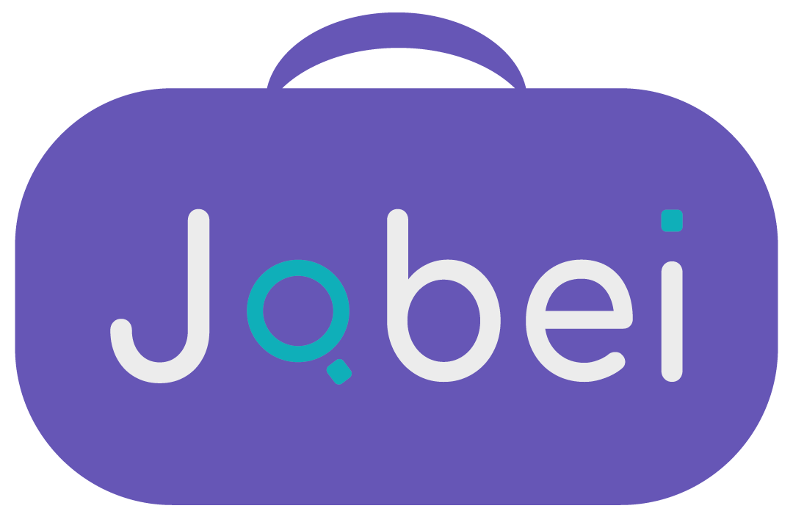

 </img> 

<h3 align="center"> Profissionais perto de você </h3>

    
    
    
    

---
## :bookmark: Sobre

Olá, somos a Jobei! 
Uma plataforma cujo objetivo é estimular o comércio e o empreendedorismo local de forma que você possa contatar os serviços de trabalhadores autônomos da sua região de forma fácil e prática.

- [Landing Page](http://jobei.infinityfreeapp.com/landing-page)
- [Sobre](http://jobei.infinityfreeapp.com/landing-page/index.html#sobre)
- [Explore](http://jobei.infinityfreeapp.com/landing-page/index.html#explore)
- [Planos](http://jobei.infinityfreeapp.com/landing-page/index.html#planos)
- [Contato](http://jobei.infinityfreeapp.com/landing-page/index.html#contato)

Acesse nossa plataforma pelos links ou escaneie o QR Code 

## :rocket: Tecnologias 
Abaixo estão listadas as linguagens de programação, softwares de design e os softwares de desenvolvimento utilizados para a realização do projeto:

    <b>Front-end</b>  
    
    
    
       <b>Back-end</b>  
    
    
       <b>UI/UX Design</b>  
    
      
    
    
       <b>Softwares de Desenvolvimento</b>  
    
    

<!--
## :zap: Como usar 
-->

## :busts_in_silhouette: Equipe
  <b> Ana Carolyny </b>  
    
    
    
  
  <b> Bianca Silva </b>  
    
    
    
   
  <b> Emanuela de Almeida </b>   
    
    
    
    
  <b> Isabelle Damacena </b>   
    
    
    
  
### :mortar_board: Créditos
Projeto desenvolvido para o Trabalho de Conclusão de Curso (TCC) do Ensino Médio Integrado ao Técnico de Informática Para Internet da Etec Prof.ª Maria Cristina Medeiros e orientado pela prof.ª Cintia Pinho.

## :memo: License
Esse projeto está sob a [Licença MIT](LICENSE).

---

 @Jobei 2021 

